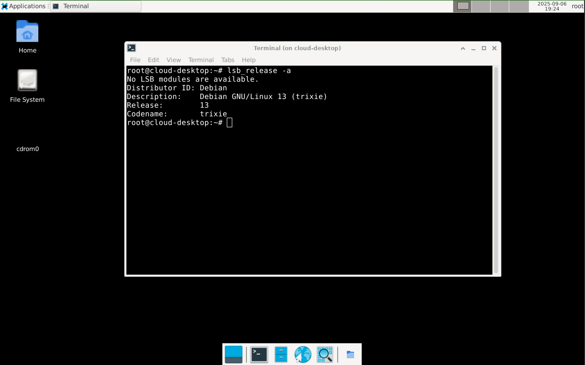

# hetzner-desktop-deploy
Automated provisioning of a Debian VM with XFCE desktop and public IP, using Terraform and Ansible. The desktop installation can easily be stripped from the playbook to create a headless VM.



## Requirements
Local:<br>
- terraform
- ansible-playbook
- whois (for the mkpasswd utility)
- private ssh key (as private.key)

Cloud platform:<br>
- Precreated ssh key and API token.

## how-to
- Place the private ssh key file in the project folder named "**private.key**".
- Paste API token and the name of the ssh key to use in **terraform.tfvars**.
- Run ```./deploy.sh``` and choose your root account password and VNC password.

### destroy VM
To destroy the created VM, run ```terraform destroy```.

## Access 
The IP of the VM is printed in the terraform output. The VM can be accessed with SSH and/or a VNC client (port 5900) using the passwords you provided. Login with the root user in the desktop login once connected with VNC.<br>
